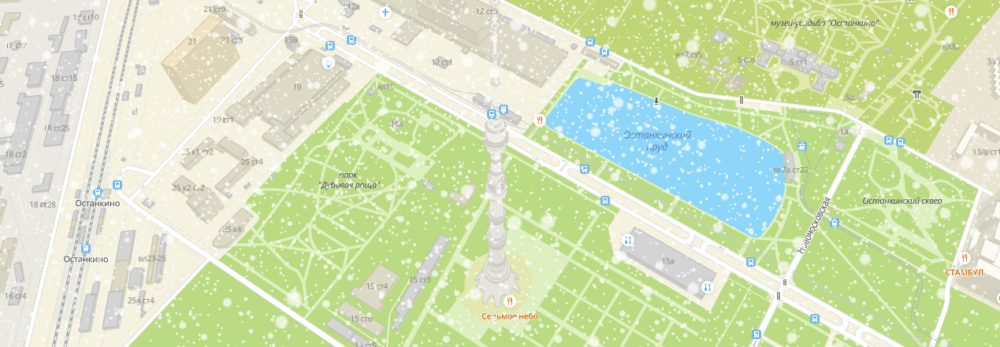

# mapgl-snow

Plugin to add falling snow to your [2GIS MapGL map](https://docs.2gis.com/en/mapgl/overview).



[See a demo](https://trufi.github.io/mapgl-snow/)

## Using

Install with NPM:

```bash
npm install mapgl-snow
```

Then initialize with passing MapGL Map object:

```js
import { load } from '@2gis/mapgl';
import { Snow } from 'mapgl-snow';

load().then((mapgl) => {
    // Initialize MapGL map
    const map = new mapgl.Map('map', {
        center: [82.920412, 55.030111],
        zoom: 15,
        key: 'YOUR MAPGL API KEY',
    });

    // Initialize snow
    const snow = new Snow(map);

    // Change snow options on the fly
    snow.setOptions(options);
});
```

Install in browser:

```html
<html>
    <head>
        <script src="https://mapgl.2gis.com/api/js/v1"></script>
        <script src="https://unpkg.com/mapgl-snow"></script>
    <head>
    <body>
        <div id="map"></div>
        <script>
            const map = new mapgl.Map('map', {
                center: [37.590783, 55.731226],
                zoom: 13.48,
                key: 'Your API key here',
            });
            const snow = new mapglSnow.Snow(map);
        </script>
    </body>
</html>
```

Snow options have several fields:

-   `minZoom` – the minimum zoom from which the snow will be shown
-   `color` – the color of the snowflakes in RGBA format, e.g. `[255, 255, 255, 1]`
-   `size` – the size of the snowflakes
-   `particleNumber` – the amount of the snowflakes
-   `velocityX`, `velocityY`, `velocityZ` – the wind speed in each direction
-   `dispersion` – the dispersion of the speed
